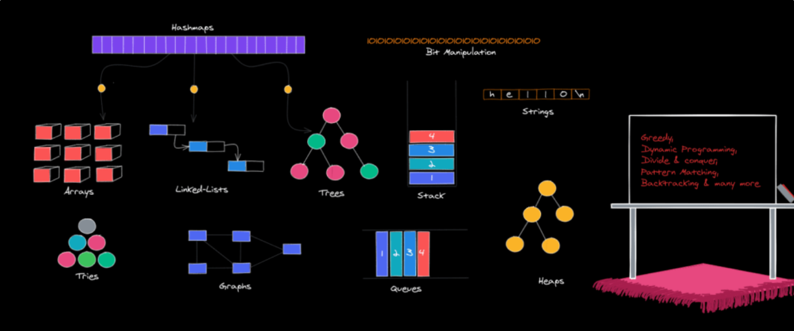

# Object Oriented Programming #

#### Encapsulation
- point 1
- point 2
- point 3
#### Polymorphism
- point 1
- point 2
- point 3
#### Abstraction
- point 1
- point 2
- point 3
#### Inheritance
- point 1
- point 2
- point 3

# Software Development Life Cycle # 

# System Design #

Helpful PDFs/ Articles
- [Top 10 System Design Interview Questions and Answers - geeksforgeeks](https://www.geeksforgeeks.org/top-10-system-design-interview-questions-and-answers/)
- [System Design Interview Questions – Concepts You Should Know - freecodecamp](https://www.freecodecamp.org/news/systems-design-for-interviews/)
- 
Courses
- [Grokking the System Design Interview - educative.io ](https://www.educative.io/courses/grokking-the-system-design-interview)
- [System Design Course for Beginners - YouTube](https://www.youtube.com/watch?v=MbjObHmDbZo)

# Data Structures & Algorithms # 

Helpful PDFs/Articles
- [hackernoon.com - 14 Patterns to Ace Any Coding Interview](https://hackernoon.com/14-patterns-to-ace-any-coding-interview-question-c5bb3357f6ed)
- [Cracking the Coding Interview](https://cin.ufpe.br/~fbma/Crack/Cracking%20the%20Coding%20Interview%20189%20Programming%20Questions%20and%20Solutions.pdf)

Courses
- [Grokking the Coding Interview: Patterns for Coding Questions - educative.io](https://www.educative.io/courses/grokking-the-coding-interview)
- [CodeAcademy - Pass the technical interview with Java](https://www.codecademy.com/learn/paths/pass-the-technical-interview-with-java)

 Problem | Description  | Difficulty | Algorithm/Strategy Applied | Solution
--- | --- | --- | --- | --- |
#34 - Find First and Last Position of Element in Sorted Array | [Problem Description](https://leetcode.com/problems/find-first-and-last-position-of-element-in-sorted-array/) | Medium | Binary Search |  [Java](https://leetcode.com/problems/linked-list-cycle/) |
#215 - KthLargestElementInAnArray| [Problem Description](https://leetcode.com/problems/kth-largest-element-in-an-array/) | Medium | Quick Sort | [Java](https://github.com/idkburkes/Algorithm-Practice/blob/master/Solutions/QuickSort/KthLargestElementInAnArray.java)  |   
#3 - Longest Substring without Repeating Characters    |  [Problem Description](https://leetcode.com/problems/longest-substring-without-repeating-characters/) | Medium  | Sliding Window | [Java](https://github.com/idkburkes/Algorithm-Practice/blob/master/Solutions/Sliding%20Window/LongestSubstringWithoutRepeatingCharacter.java) |  
#151 - Reverse Words in a String | [Problem Description](https://leetcode.com/problems/reverse-words-in-a-string/) | Medium | Sliding Window | [Java](https://github.com/idkburkes/Algorithm-Practice/blob/master/Solutions/Sliding%20Window/ReverseWordsInAString.java) |
#207 - Course Schedule | [Problem Description](https://leetcode.com/problems/course-schedule/) | Medium | Breadth-First Search | [Java](https://github.com/idkburkes/Algorithm-Practice/blob/master/Solutions/Graph/CourseSchedule.java) | 
#463 - Island Perimeter | [Problem Description](https://leetcode.com/problems/island-perimeter/) | Easy | Depth-First Search | [Java](https://github.com/idkburkes/Algorithm-Practice/blob/master/Solutions/Graph/IslandPerimeter.java) | 
#5 - Longest Palindromic Substring | [Problem Description](https://leetcode.com/problems/longest-palindromic-substring/) | Medium | Dynamic Programming | [Java](https://github.com/idkburkes/Algorithm-Practice/blob/master/Solutions/Dynamic%20Programming/LongestPalindromicSubstring.java) |
#210 - Course Schedule II | [Problem Description](https://leetcode.com/problems/course-schedule-ii/) | Medium | Breadth-First Search | [Java](https://github.com/idkburkes/Algorithm-Practice/blob/master/Solutions/Graph/CourseSchedule2.java) |
#148 Sort List | [Problem Description](https://leetcode.com/problems/sort-list/) | Medium | Merge Sort / Fast&Slow Pointer | [Java](https://github.com/idkburkes/Algorithm-Practice/blob/master/Solutions/LinkedList/SortList.java) |
#206 Reverse Linked List | [Problem Description](https://leetcode.com/problems/reverse-linked-list/) | Easy | LinkedList Pointer Manipulation | [Java](https://github.com/idkburkes/Algorithm-Practice/blob/master/Solutions/LinkedList/ReverseLinkedList.java) |
#141 Linked List Cycle | [Problem Description](https://leetcode.com/problems/linked-list-cycle/) | Easy | Fast&Slow Pointer | [Java](https://github.com/idkburkes/Software-Engineering-Interview-Prep/blob/master/Solutions/LinkedList/LinkedListCycle.java) | 
#21 Merge Two Sorted Lists | [Problem Description](https://leetcode.com/problems/merge-two-sorted-lists/) | Easy | Merge Sort on LinkedList | [Java](https://github.com/idkburkes/Software-Engineering-Interview-Prep/blob/master/Solutions/LinkedList/MergeTwoSortedLists.java)
#23 Merge K Lists | [Problem Description](https://leetcode.com/problems/merge-k-sorted-lists/) | Hard | Merge Sort on LinkedList | [Java](https://github.com/idkburkes/Software-Engineering-Interview-Prep/blob/master/Solutions/LinkedList/MergeKLists.java)
#19 Remove Nth Node from end of list | [Problem Description](https://leetcode.com/problems/remove-nth-node-from-end-of-list/) | Medium | Fast&Slow Pointer | [Java] |
#143 Reorder List | [Problem Description](https://leetcode.com/problems/reorder-list/) | Medium | Fast&Slow Pointer | [Java] |
